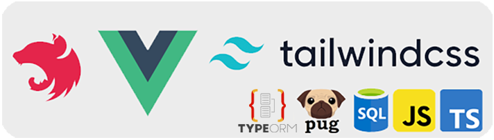

<p align="center">
  
</p>

## Описание

Проект включает в себя три основные технологии: NestJS, VueJS и TailwindCSS  
и позволяет осуществлять одновременную разработку в режиме `watch` как ux так и ui  

Так же в проекте реализовано подключение к базе данных MS SQL с автосинхронизацией сущностей  

P.S. не забудьте добавить свой `.env.development` и `.env.production` с конфигурациями подключения

## Установка

```bash
# установка пакетов/зависимостей для backend
$ npm i

# переходим в UI и устанавливаем зависимости для frontend
$ cd ui-kstt
$ npm i

# возвращаемся обратно в корень приложения
$ cd ..
```

## Запуск приложения

```bash
# development watch mode ux and ui (http://localhost:3000/)
$ npm run watch-ks

# development watch mode only ux (http://localhost:3000/)
$ npm run watch-ux

# build
$ npm run build

# production mode (http://localhost:7000/)
$ npm run start:prod
```